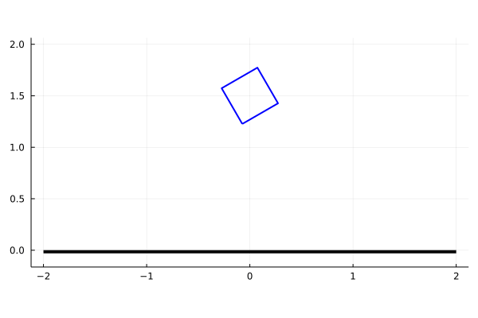
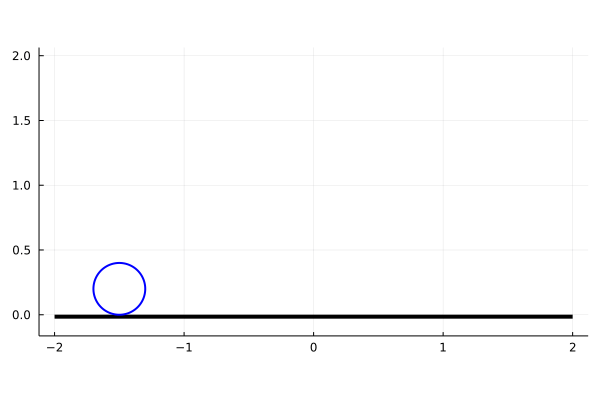

# contact_walk

Contact simulation of passive locomotion of the 2D Dynamic Walker 

## Installation
1. Open your Julia REPL by typing  `julia` in your terminal.
2. Press `]` on your keyboard to enter the package manager
3. Enter command `add https://github.com/adubredu/contact_walk.jl` and press 
`Enter` on your keyboard to install this package.
4. Press the `Backspace` key on your keyboard to return to the REPL

## Usage
Example scripts can be found in the [examples](examples) folder in this repo.

The [block_sim.jl](examples/block_sim.jl) simulates physics of a 2D square block dropped from a height, as shown below:  

The [ball_sim.jl](examples/ball_sim.jl) simulates physics of a 2D ball dropped from a height, as shown below:  

